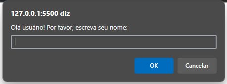
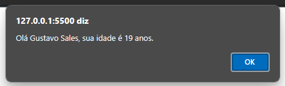

# hora-de-codar
## 📖 Sobre a atividade

Agora, colocarei a prova meus conhecimentos sobre lógica de programação com algumas quests de javascript que foram escritas pelo mestre Gabriel Azevedo.

## Exercício 01
Escreva um programa em Javascript e crie uma variável chamada "nome_do_carro" e atribua-a um valor "Fusca". Exiba-a ao usuário.  
<a href="./tasks/task01.html">Resolução</a> 

## Exercício 02
Escreva um programa em Javascript em que o usuário informe o seu nome e exiba a mensagem "Olá, { NomeDoUsuario }". 
<a href="./tasks/task02.html">Resolução</a> 

## Exercício 03
Escreva um programa em Javascript em que o usuário informe o seu nome e em seguida o programa perguntará a idade do usuário. Agora o programa deve exibir a mensagem "Olá, { NomeDoUsuario }, sua idade é { idade }". 
<a href="./tasks/task03.html">Resolução</a> 
